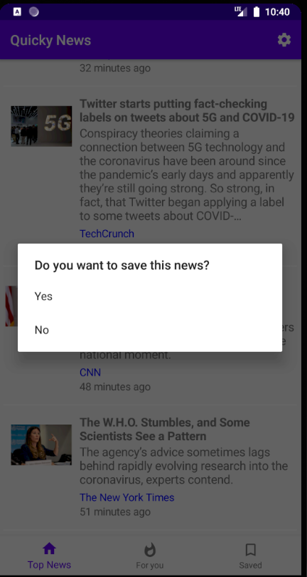
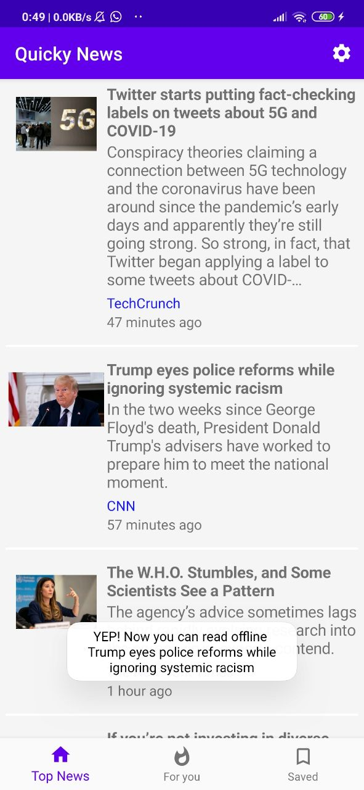
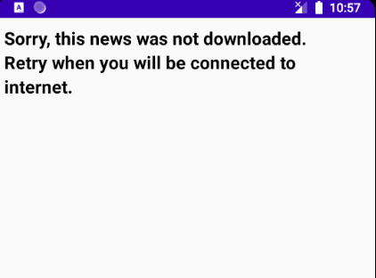
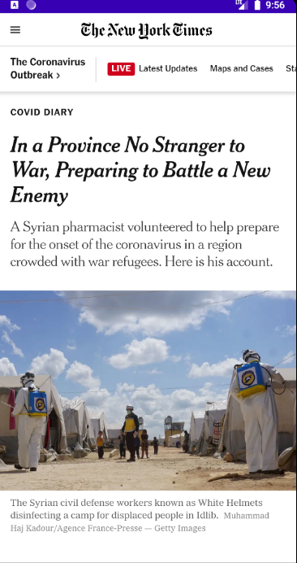
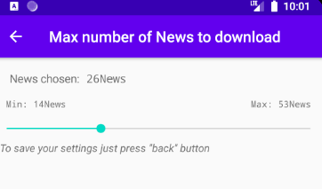

# QuickyNews

  
  
  

    Browse the latest news close to you 
     

Project made by three students (Giovanni, Pietro e Francesco) of the University of Padua for the course of "Programmazione di Sistemi Embedded 2020".

## Summary

  - [Getting Started](#getting-started)
  - [Usage](#usage)
  
## Getting Started

This app is realized following the Android go guidelines (precisely Build for Billions).
The app is composed of three parts: Top News, where you can find all the news, For You, where we filter the Top News-news based on your tastes and last but not least, the heart of the project, Saved, where we saved the news you want and where you can read them offline. 
So, the aim of this app is to always have news at your fingerprints, even if you are offline, how? We use <a href="https://developer.android.com/topic/libraries/architecture/room">Room.</a>
But what should you have to do to save a news? Just with one click, let's see how.

## Usage 

* Connect your phone to internet

* Click-long on a news you'd like to save and click on yes:

    If the news was saved a toast will appear saying that you can find the news on Saved; in the meanwhile its HTML page is downloading:    if the download will be completed, another toast will apper saying:

    
    ok, now if you remove the connection to internet, you will be able to see something like this :

    
    What? Is it a small font? Of course you can change it on settings.  

    if something went wrong, and the page was not downloaded, this page will apear: 

    So you should retry to download it.
  
  
    Instead, if you are connected to internet, you will be redirected to the official website, easy right?
  
  
  
  
  * Now ,let's talk about about our idea: in settings, you can set a parameter, which consists in how many news a user can keep on Saved (that is, the number of HTML pages a user can read offline).
  
  
  
    In this case, the number is set to 19, and it has a range of [14,53].
  
    When the user will reach 9 saved news (which is 19-10), an alert will be prompted :
  
   
   
   
    
    We call this as " First phase: Warning " -> we warn the user BEFORE he loses his saved data, so that he becomes acquinted of the potential danger.
    
    When the user will reach the max set number (19) of possible news to save, the app will remove 20% of the max number from saved.
    
    
   
  

